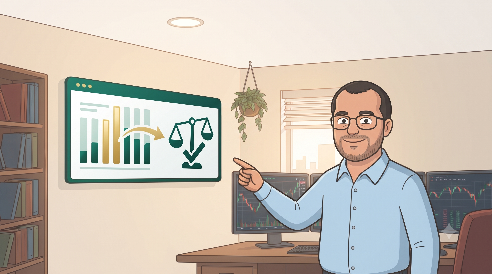
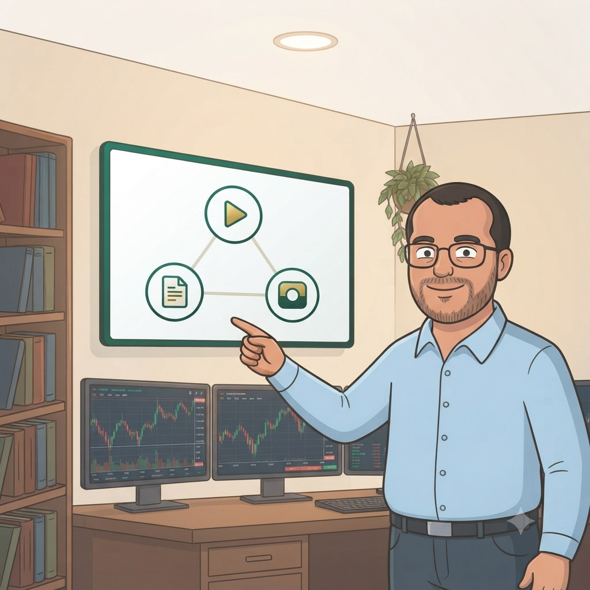

Invierto Mi Tiempo es un proyecto que documenta, con datos reales, cómo puede crecer una
inversión cuando las decisiones se apoyan en indicadores y en un proceso repetible, en
vez de en el instinto o en lo primero que se escucha en redes sociales. Desde mayo de
2026 vengo invirtiendo mi propia plata y llevando registro de cada decisión, y quiero
compartir ese proceso con quien esté en una etapa parecida a la mía.

El propósito es simple de decir y más difícil de encontrar en el mundo de las finanzas:
acercar la inversión a la gente común, de forma simple, y con evidencia real de cómo y
cuánto puede crecer una inversión — no con promesas ni con teoría abstracta, sino con
números propios sobre la mesa.

## El eje central: indicadores y un score, no corazonadas

Lo que diferencia este proceso no es la plata que invierto — es bastante limitada, acorde
a mis propios ingresos — sino cómo decido dónde ponerla. Establecí un conjunto de
indicadores propios para evaluar una empresa: cuando esos indicadores alcanzan ciertos
niveles, me dan la confianza suficiente para considerarla una candidata seria dentro de
mi estrategia.

Para no depender de revisar esos indicadores a mano cada vez, construí un sistema con
Python, IA y n8n que los calcula automáticamente y los combina en un score. Ese score es
el que uso como punto de partida para tomar mis decisiones: no reemplaza mi criterio,
pero sí ordena la información y le quita ruido emocional al proceso. Ese sistema —cómo
está armado, qué mide y cómo lo voy ajustando— va a ser uno de los temas centrales de
todo lo que publique de aquí en adelante.

## Dónde vas a encontrar este proceso

Este proyecto se cuenta en más de un formato, y esta web es uno de esos medios, no el
único. En el canal de YouTube se ve el proceso en video: pantallas, herramientas,
revisiones de cartera. En Instagram comparto ideas cortas y avisos de contenido nuevo.
Y acá, en la web, el contenido queda ordenado por tema para que se pueda buscar y releer
sin depender de en qué minuto de un video se explicó algo: fundamentos para partir de
cero, la estrategia de dividendos en profundidad, cómo funciona la automatización con
Python/IA/n8n, un diario de resultados, comparativas entre invertir en Chile y en el
extranjero, y una sección de recursos con lo que uso.

## Las reglas del juego de este proyecto

Antes de que sigas leyendo lo que venga, quiero dejar clara la lógica con la que voy a
escribir todo esto:

Este es mi proceso de aprendizaje autodidacta, documentado en público. No soy asesor
financiero ni estoy registrado como prestador de servicios financieros ante la CMF, y
nada de lo que publico es una recomendación de inversión. Cuento qué indicadores uso,
cómo los combino en un score, y qué hago yo con mi propia plata a partir de eso — no lo
que tú deberías hacer con la tuya. Si en algún artículo describo una decisión de
inversión, es un hecho pasado narrado en primera persona, con mi razonamiento, para que
aprendas del proceso, no un veredicto sobre si te conviene o no replicarla.

La otra regla es la transparencia con resultados reales. Voy a mostrar los aportes que
puedo hacer cada mes — que están limitados por mis propios ingresos, así que no esperes
cifras espectaculares — y los resultados tal cual sean, buenos o mediocres. Eso es lo que
más me interesa aportar frente a otros canales de finanzas que hablan solo desde la
teoría: acá vas a ver el proceso completo, con evidencia real de cómo y cuánto crece (o
no) una inversión, errores incluidos.

Por último, voy a mantenerme en el anonimato. Es una decisión personal de comodidad, no
tiene nada que ver con esconder algo del contenido.

## Qué va a pasar ahora

Los próximos artículos van a ir directo a la sección de Fundamentos, porque quiero que
cualquiera que llegue nuevo tenga un punto de partida claro antes de meterse en temas más
específicos como el detalle de mis indicadores, cómo se arma el score con Python/IA/n8n,
o los resultados mes a mes. Si ya me seguías en el canal, esto no reemplaza nada — lo
complementa. Si llegaste por primera vez desde Instagram o desde este artículo,
bienvenido: la idea es que veas este proceso crecer, con datos reales sobre la mesa.
